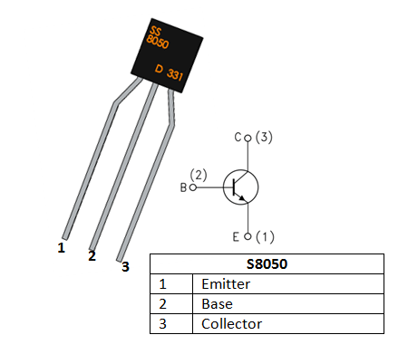
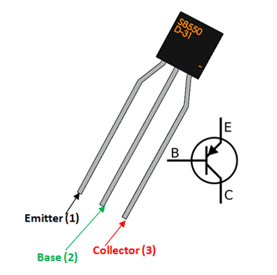

Exercises

Follow the Tutorials listed below from the FreeNove Super Starter Kit:

- Chapter 6 Buzzer
  - Doorbell
  - Alerter
  - Alerter (with timer)

- Chapter 3 LED Bar
  - Flowing Light 

### NPN Transistor

- https://youtu.be/w8-pq5bYbQM?si=HN9uI54GAZUWCVNr
- https://components101.com/transistors/s8050-transistor-pinout-equivalent-datasheet

<iframe width="560" height="315" src="https://www.youtube.com/embed/w8-pq5bYbQM?si=2DNlDNwlQh_o4bUP" title="YouTube video player" frameborder="0" allow="accelerometer; autoplay; clipboard-write; encrypted-media; gyroscope; picture-in-picture; web-share" referrerpolicy="strict-origin-when-cross-origin" allowfullscreen></iframe>

### PNP Transistor

- https://components101.com/transistors/s8850-pinout-equivalent-datasheet

[Back to Session 04...](ReadMe.md)
